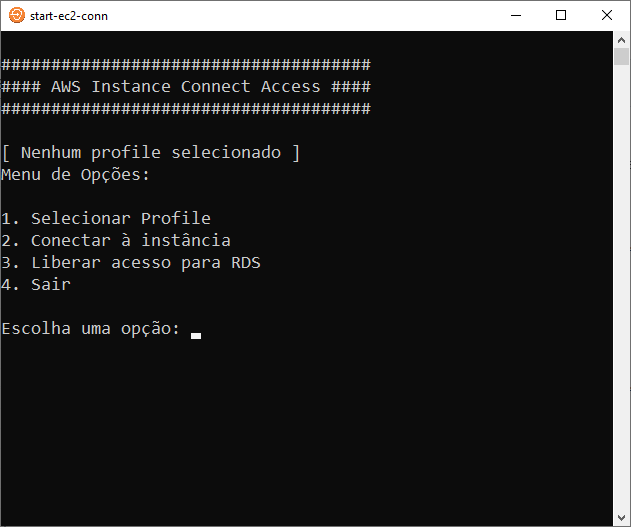

# Introdução

Este projeto provê um menu para usar o AWS Instance Connect Endpoint para listar e conectar à instâncias EC2 usando SSH por meio da AWS CLI.

# Pre-requisites

Antes de usar você precisa instalar a AWS CLI. Siga os passos [aqui](https://docs.aws.amazon.com/cli/latest/userguide/getting-started-install.html).
Com a AWS CLI instalada, crie seu profile com o comando:

``
aws configure --profile meu-profile
``

Este projeto usa Python 3. Baixe e instale o Python [aqui](https://www.python.org/downloads/) e então, na pasta do projeto, execute este comando para instalar as dependências:

``
pip install -r requirements.txt
``

# Usando

No terminal acesse a pasta do projeto e execute:

``
~/> python app.py
``

O resultado deve ser como apresentado neste exemplo:

