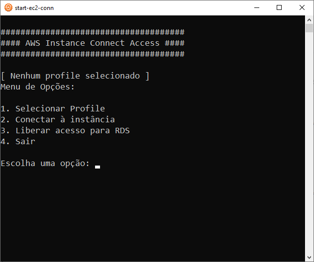

# Introduction

This project provides a menu to use AWS Instance Connect Endpoint to list and connect to EC2 instances using SSH through AWS CLI.

# Pre-requisites

First of all you need to install AWS CLI. Follow the steps [here](https://docs.aws.amazon.com/cli/latest/userguide/getting-started-install.html).
With AWS CLI installed create your profile with the command:

``
aws configure --profile my-profile
``

This project run in Python 3. Download and install from (here)[Python](https://www.python.org/downloads/) and them, in the project folder, run this command to install dependencies:

``
pip install -r requirements.txt
``

# Using

In a terminal access the project's folder and run:

~/> python app.py

The result must be as this example:

